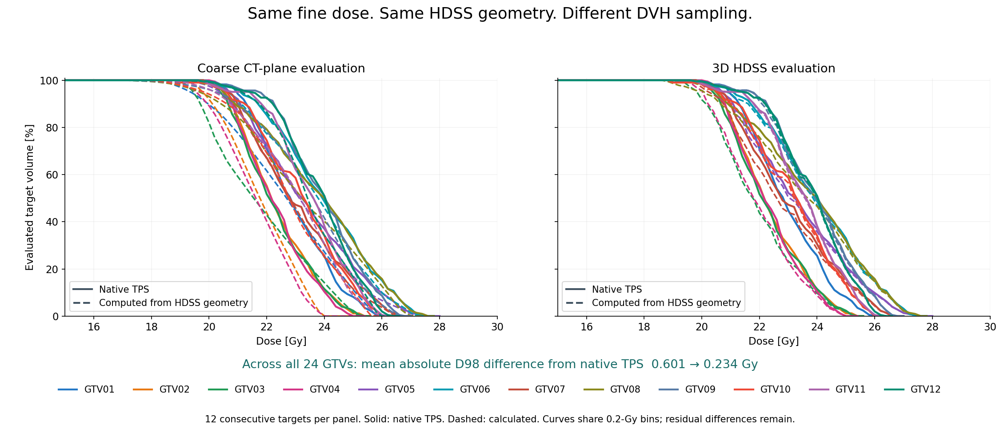

# srs-dvh

[](https://github.com/Kiragroh/srs-dvh/actions/workflows/tests.yml)

**A reusable 3D DVH builder for HDSS-derived and other high-definition structures.**

## The problem

A tiny SRS target may span only a few CT slices. Evaluating those sections alone
can give boundary regions the wrong weight in the DVH, even when the dose has
not changed. Finer structure information is useful only if the DVH calculation
also uses it.

## Our approach

Keep the fine source geometry and dose in the same physical coordinates. Recover
an explicit 3D surface from the HDSS-derived source, then evaluate the fine
dose-grid points inside it. This retains information between CT planes instead
of reducing the target to a few coarse sections. The source TPS in this benchmark
also retains fine target geometry and local dose grids.

The figure compares both readouts using **the same HDSS surface and the same fine
input dose**. Across all 24 original GTVs, the mean absolute D98 difference from
the source TPS decreases from **0.601 Gy with coarse 1-mm plane-only evaluation
to 0.234 Gy with the 3D HDSS method**. Mean-dose differences decrease from
**0.309 to 0.096 Gy**. Agreement improves overall; residual differences remain.



This is a reusable calculation method, not a dependency on a proprietary TPS.
The core accepts physical-space geometry and dose arrays; a DICOM reader supplies
the source-plane interpretation. The [illustrated explanation](docs/dvh_explained.md)
shows how the geometry, dose samples and volume weights become a DVH.

## Why small targets benefit most

A 6.5-mm³ sphere is about **2.32 mm across**. A few sections therefore have much
more relative influence than they do in a large target. A steep dose gradient
near the boundary can magnify the effect on D98. For larger targets and gentle
gradients the improvement may be small. A properly refined slice-based integrator
can also be accurate; our measured comparison is with the stated coarse
plane-only method, not every algorithm that processes slices.

The package also provides **weighted full-volume integration** with refinement
checks for controlled transfer studies and mathematical validation. Its volume
weights differ from the discrete surface/grid readout. Neither method can restore
shape or dose detail already missing from its input.
[Calculation details](docs/methods.md) · [Surface/grid API](docs/surface_grid.md)

## Install and run

Python 3.10 or newer. Clone the repository and install locally:

```sh
git clone https://github.com/Kiragroh/srs-dvh.git
cd srs-dvh
python -m pip install -e ".[contours,surfaces,dev,examples]"
python examples/quickstart.py
python -m pytest tests -q
```

The package is distributed through this repository; these instructions do not
assume a PyPI release. NumPy and SciPy are the core dependencies. Shapely is
needed for the polygon adapter; scikit-image and VTK for the optional surface
adapter; Matplotlib for example figures.

## Use with your own arrays

```python
from srs_dvh import DoseGrid, VoxelROI, converge

# Arrays and affines must already describe the same physical coordinate frame.
dose = DoseGrid(dose_array_Gy, dose_index_to_world_affine)
roi = VoxelROI(binary_mask, roi_index_to_world_affine)
dvh, evidence = converge(roi, dose)

if not evidence["converged"]:
    raise RuntimeError("Integration has not met the refinement criteria")

print(dvh.metrics())
volume_percent = dvh.volume_at_dose([15, 18, 20, 22, 25, 28])
```

Coordinates are in **mm**, dose in **Gy**, volume weights in **mm³**. Each affine
maps array-index **voxel centres** to physical coordinates. There is no assumed
array-axis order: the affine columns define it. Verify registration first. No
shift, dose scaling or threshold is fitted to a reference TPS curve.

## Supported geometry

| Input | Evaluated volume |
|---|---|
| `VoxelROI` | Complete occupied binary voxels, including the outer half-voxel extent |
| `ImplicitROI` | A mathematical body specified by a physical-space predicate and bounding box |
| `PolygonSlabROI` | Polygons with holes and explicit slab intervals on parallel, possibly oblique planes |
| `SurfaceROI` with `calculate` | Interior of a supplied closed surface, using refined midpoint volume integration |
| Custom adapter | `quadrature(step_mm)` yielding physical points and positive volume weights |

High-definition source planes can be evaluated in their own basis without first
sampling them onto CT slices. The [oblique-contour example](examples/oblique_contours.py)
shows this interface. For DICOM RTSTRUCT or HDSS files, a separate reader must
supply the correct source planes, physical frame and geometric reconstruction.
This release is a numerical DVH builder, not a DICOM importer or HDSS file writer.

`PolygonSlabROI` integrates an **explicit polygon-prism model** using exact clipped
areas. It does not guess missing contours or a TPS-specific interpolation between
planes. See the [methods and input contract](docs/methods.md).

## Accuracy and examples

The repository contains **25 tests** covering known spherical DVHs, oblique and
anisotropic coordinates, unequal volume weights, holes, tiny contour caps,
out-of-grid rejection and refinement checks, plus surface reconstruction,
discrete grid sampling, nested cavities and explicit partial coverage.

The [analytical benchmark](examples/analytical_benchmark.py) uses four
sphere/ellipsoid configurations. At 0.025-mm integration spacing, its largest
absolute D98 error against the exact continuous-dose result is **0.0012 Gy**.
The largest curve error on the benchmark's stated plotting thresholds is
**0.157 percentage points**. These are results for those test fields, not a
universal accuracy guarantee. [Results and scope](docs/validation.md).

<details>
<summary>Methods appendix: mathematical accuracy and dose-grid effects</summary>


*Separate analytic validation: a known 6.5-mm³ sphere in a deliberately steep
dose field. The exact reference is mathematical. These curves do not stand in
for the actual benchmark's native-TPS comparison.*

```sh
python examples/analytical_benchmark.py --output-dir results/analytical
```

This example separates **volume sampling** from **input dose-grid sampling**.
It exports a figure and machine-readable results showing what can otherwise be
lost. All inputs are mathematical objects; no patient data or TPS access is needed.

</details>

`converge` requires **two consecutive refinements** to satisfy dose-metric,
volume and curve tolerances. The curve comparison uses the exact maximum
difference between the two empirical DVHs over **all observed dose thresholds**,
independent of plotting bins. Always inspect the returned evidence.

Numerical convergence applies to the supplied dose and geometry. It does not
prove that those inputs reproduce a TPS's internal surface or DVH volume.
No TPS is launched and no input DICOM is changed.

## For vendors and researchers

High-definition geometry support and adequate DVH evaluation belong together:
discarding the additional geometry during evaluation can remove its benefit.
Input dose resolution also matters. The [comparison protocol](docs/vendor_comparison.md)
separates geometry transfer, dose representation, numerical integration and
replanning. Use analytical tests before comparing real plan data.

Research software; clinical use requires separate commissioning and validation.

## Cite and contribute

Use [CITATION.cff](CITATION.cff) and the specific release or commit for reproducible
references. No DOI or peer-reviewed validation paper is claimed by this release.
Reproducible issues and pull requests are welcome; use synthetic examples rather
than patient information. Licensed under [MIT](LICENSE).
