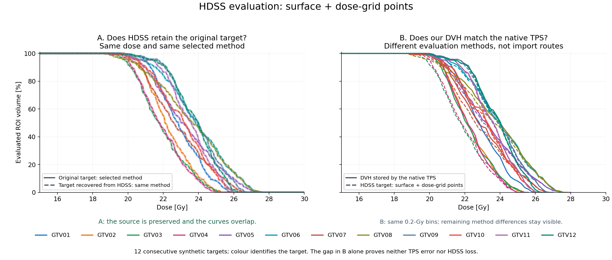

# srs-dvh

[](https://github.com/Kiragroh/srs-dvh/actions/workflows/tests.yml)

**A DVH builder for high-definition, HDSS-like structures**, with particular
attention to small SRS targets. It offers two explicit evaluation methods in
physical coordinates; neither requires reducing the structure to CT slices.

**HDSS carries detailed structure information. It does not define how a DVH is
calculated.** A DVH also depends on the dose grid, the reconstructed boundary and
which volume is counted. Two programs can therefore read the same structure
information and still show different DVHs.

| Method | How it calculates the DVH | Purpose |
|---|---|---|
| **Full-volume integration** — `calculate` / `converge` | Subdivide the represented body, evaluate dose throughout it, and accumulate positive physical volume weights. | Common fixed-dose transfer comparison, with numerical refinement checks. |
| **Surface + dose-grid points** — `calculate_grid_centres` | Reconstruct or supply a surface; count only existing interior dose-grid centres, each with a complete dose-cell volume. | Investigate discrete native TPS readouts; boundary cells are not fractionally weighted. |

The surface/grid method is **closer to the native TPS in this benchmark**. It is
not established as a more accurate full-volume calculation. Its sampled volume
can differ from the source or mesh volume. For a fair transfer comparison, keep
the dose, geometry interpretation and evaluation rule fixed.

## Why this matters for small structures

A 6.5-mm³ sphere is only about **2.32 mm across**. With 1-mm sections, a few
cross-sections can dominate the readout. Their position can change which boundary
regions contribute; in a steep SRS dose gradient, this can change coverage metrics
such as D98 even at unchanged physical dose.

Full-volume integration samples through the represented volume; `converge`
checks stability under refinement. This addresses a coarse plane-only evaluation;
**a properly refined slice-by-slice integrator can also be accurate**. For larger
targets and gentle gradients the difference may be small. Fine integration does
not restore detail already missing from the supplied structure or dose grid.

[How both methods work, with a schematic and a small-versus-large example](docs/dvh_explained.md).



The figure shows **Surface + dose-grid points**. All 120 original/recovered-HDSS
pairs agree exactly under this method. Native TPS agreement is a different test:
**6/154 complete GTV histograms** match. The earlier **2/24** result refers to
the original GTV-only subset; the 154 readouts span seven plans of the same 24
synthetic target designs. [All-target results and runnable example](docs/surface_grid.md).

Numerical accuracy is tested against known mathematical dose fields and finer
integration for each declared body model. Agreement with a native TPS is checked
separately. [Measured preservation and native-agreement evidence](docs/forward_validation.md).

## Install and run

Python 3.10 or newer. Clone the repository and install locally:

```sh
git clone https://github.com/Kiragroh/srs-dvh.git
cd srs-dvh
python -m pip install -e ".[contours,surfaces,dev,examples]"
python examples/quickstart.py
python -m pytest tests -q
```

The package is distributed through this repository; these instructions do not
assume a PyPI release. NumPy and SciPy are the core dependencies. Shapely is
needed for the polygon adapter; scikit-image and VTK for the optional surface
adapter; Matplotlib for example figures.

## Use with your own arrays

```python
from srs_dvh import DoseGrid, VoxelROI, converge

# Arrays and affines must already describe the same physical coordinate frame.
dose = DoseGrid(dose_array_Gy, dose_index_to_world_affine)
roi = VoxelROI(binary_mask, roi_index_to_world_affine)
dvh, evidence = converge(roi, dose)

if not evidence["converged"]:
    raise RuntimeError("Integration has not met the refinement criteria")

print(dvh.metrics())
volume_percent = dvh.volume_at_dose([15, 18, 20, 22, 25, 28])
```

Coordinates are in **mm**, dose in **Gy**, volume weights in **mm³**. Each affine
maps array-index **voxel centres** to physical coordinates. There is no assumed
array-axis order: the affine columns define it. Verify registration first. No
shift, dose scaling or threshold is fitted to a reference TPS curve.

## Supported geometry

| Input | Evaluated volume |
|---|---|
| `VoxelROI` | Complete occupied binary voxels, including the outer half-voxel extent |
| `ImplicitROI` | A mathematical body specified by a physical-space predicate and bounding box |
| `PolygonSlabROI` | Polygons with holes and explicit slab intervals on parallel, possibly oblique planes |
| `SurfaceROI` with `calculate` | Interior of a supplied closed surface, using refined midpoint volume integration |
| Custom adapter | `quadrature(step_mm)` yielding physical points and positive volume weights |

High-definition source planes can be evaluated in their own basis without first
sampling them onto CT slices. The [oblique-contour example](examples/oblique_contours.py)
shows this interface. For DICOM RTSTRUCT or HDSS files, a separate reader must
supply the correct source planes, physical frame and geometric reconstruction.
This release is a numerical DVH builder, not a DICOM importer or HDSS file writer.

`PolygonSlabROI` integrates an **explicit polygon-prism model** using exact clipped
areas. It does not guess missing contours or a TPS-specific interpolation between
planes. See the [methods and input contract](docs/methods.md).

## Accuracy and examples

The repository contains **25 tests** covering known spherical DVHs, oblique and
anisotropic coordinates, unequal volume weights, holes, tiny contour caps,
out-of-grid rejection and refinement checks, plus surface reconstruction,
discrete grid sampling, nested cavities and explicit partial coverage.

The [analytical benchmark](examples/analytical_benchmark.py) uses four
sphere/ellipsoid configurations. At 0.025-mm integration spacing, its largest
absolute D98 error against the exact continuous-dose result is **0.0012 Gy**.
The largest curve error on the benchmark's stated plotting thresholds is
**0.157 percentage points**. These are results for those test fields, not a
universal accuracy guarantee. [Results and scope](docs/validation.md).


*Separate analytic validation: a known 6.5-mm³ sphere in a deliberately steep
dose field. The exact reference is mathematical. These curves do not stand in
for the actual benchmark's native-TPS comparison.*

```sh
python examples/analytical_benchmark.py --output-dir results/analytical
```

This example separates **volume sampling** from **input dose-grid sampling**.
It exports a figure and machine-readable results showing what can otherwise be
lost. All inputs are mathematical objects; no patient data or TPS access is needed.

`converge` requires **two consecutive refinements** to satisfy dose-metric,
volume and curve tolerances. The curve comparison uses the exact maximum
difference between the two empirical DVHs over **all observed dose thresholds**,
independent of plotting bins. Always inspect the returned evidence.

Numerical convergence applies to the supplied dose and geometry. It does not
prove that those inputs reproduce a TPS's internal surface or DVH volume.
No TPS is launched and no input DICOM is changed.

## For vendors and researchers

High-definition geometry support and adequate DVH evaluation belong together:
discarding the additional geometry during evaluation can remove its benefit.
Input dose resolution also matters. The [comparison protocol](docs/vendor_comparison.md)
separates geometry transfer, dose representation, numerical integration and
replanning. Use analytical tests before comparing real plan data.

Research software; clinical use requires separate commissioning and validation.

## Cite and contribute

Use [CITATION.cff](CITATION.cff) and the specific release or commit for reproducible
references. No DOI or peer-reviewed validation paper is claimed by this release.
Reproducible issues and pull requests are welcome; use synthetic examples rather
than patient information. Licensed under [MIT](LICENSE).
