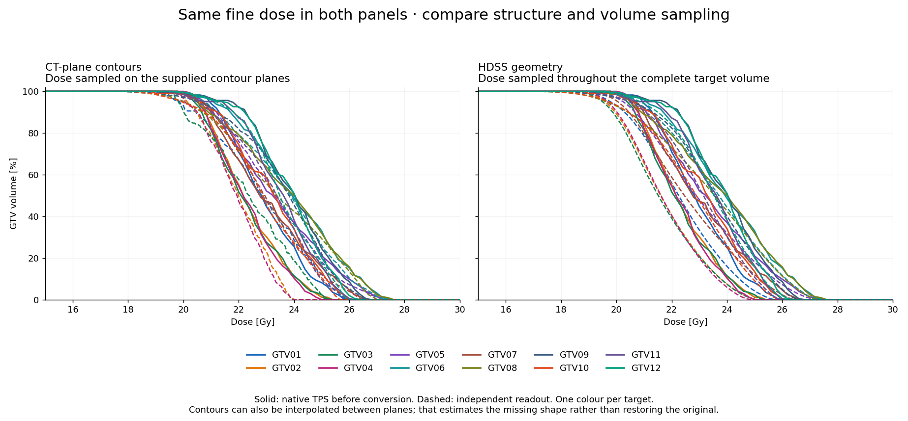

# srs-dvh

[](https://github.com/Kiragroh/srs-dvh/actions/workflows/tests.yml)

**A reusable 3D DVH builder for HDSS-derived and other high-definition structures.**

## The problem

A tiny SRS target may span only a few CT slices. Evaluating those sections alone
can give boundary regions the wrong weight in the DVH, even when the dose has
not changed. Finer structure information is useful only if the DVH calculation
also uses it.

## Our approach

**Preserve the 3D structure, then integrate dose throughout its volume.** Keep
the geometry and dose in the same physical coordinates. Divide the represented
body into small volume contributions, interpolate the available dose at each
contribution, and sum their volume weights. Refining the integration checks
whether the answer is stable. It does not require the integration points to lie
on CT slices.


Why this matters: a 6.5-mm³ sphere is only **2.32 mm across**. A few coarse
sections can give its boundary the wrong weight. Fine integration includes the
volume between those planes. The benefit is largest when targets are small or
thin and dose changes rapidly near the boundary. A properly reconstructed and
refined slice-based integrator can also be accurate; merely looping over slices
is not the problem.

## Check native TPS output separately

To show what a planning system actually displays, use its **native DVH export**:
first replot all curves, preserve repeated dose coordinates and steps, check the
screenshot, then match individual targets by ROI identity. A complete import
route can change geometry, dose representation and the native evaluator at once.
An independently computed curve must not be labelled as that TPS's result.

The exports are also **validation targets for computational hypotheses**. On a
synthetic SRS benchmark, discrete dose values with fractional ROI weights explain
RayStation's steps; shape reconstruction plus dose interpolation comes much closer
to Eclipse's smooth curves. Those mechanisms were tested on DICOM inputs without
fitting curve shifts or dose scales. They are distinct from our common 3D evaluator.
[Native results, tested mechanisms and remaining differences](docs/tps_method_hypotheses.md).

Our same-fine-dose check does **not** establish closer native-TPS emulation:
the plane-based readout has the smaller mean D98 gap in all five target groups.
HDSS preserves more geometry, but agreement with a proprietary DVH is a separate
question. The builder's purpose is a consistent evaluation of a stated 3D body,
with numerical refinement checks—not fitting a native curve.

<details>
<summary>Independent-method comparison against the native reference</summary>

The solid curves below are the **native TPS DVHs before any export**. The dashed
curves show two independent workflows for the same twelve synthetic targets:

- **Left:** ordinary CT-plane contours, evaluated on the supplied planes with
  fine in-plane sampling and complete plane-volume weights.
- **Right:** geometry recovered from HDSS and fine source dose, evaluated
  throughout the reconstructed 3D volume at 0.05-mm spacing.

**Both panels use the same fine source dose.** Dose-grid spacing is not the
spacing used to sample the target volume.



The right-hand workflow uses source-geometry information that ordinary contours
no longer contain. Ordinary contours can also be interpolated between planes,
but that estimates a missing shape; it does not uniquely restore the original.
In this same-dose comparison, the plane readout has a smaller mean D98 gap from
the native TPS in each target group. **Full-volume integration is not a claim
of closer TPS emulation.** It evaluates a stated 3D body consistently; boundary
weighting remains a source of disagreement. Geometry preservation and native
DVH agreement are different tests. [Measured agreement and limits](docs/forward_validation.md).

The ordinary-DICOM comparison also deserves careful sampling. We tested
dicompyler-core 0.5.6 defaults and four refinement settings across all 120
target/plan states. An analytical ramp exposed a coordinate mismatch in its
optional resampling, so that option is shown as a diagnostic, not as evidence
for an HDSS benefit. The main plane readout interpolates the same fine dose used
by the complete-3D readout at the actual physical coordinates. Separate diagnostic
curves use regular exported dose and therefore change the input dose too.
[Options and reproducible audit](docs/dicompyler_fairness.md).

</details>

## Then isolate what the structure transfer changes

Keep **the dose and evaluator identical** for original and transferred geometry.
Now a changed DVH reflects a changed represented target, rather than a different
dose field or another TPS's evaluator. This is the comparison the builder enables.

<details>
<summary>Source preservation check: why the original and decoded HDSS can overlap exactly</summary>


Across 120 GTV/PTV source–HDSS pairs, D98 and integrated volume are identical;
the largest plotted curve difference is **0.00011 percentage points**. Decoding
the HDSS source grid recovers the original binary geometry in this dataset.
Both use the same unsmoothed level-0.5 surface. Simply treating the exported
contours as slabs gives a different body and can give nonzero volume/Dice differences.
Exact source recovery is therefore compatible with those differences, and is
not a claim of exact native-TPS DVH agreement.

</details>

For replanning, calculate a new plan with the same template and evaluate its dose
on **both the original and reimported targets**. New optimisation adds variability;
it must be distinguished from the unchanged-dose geometry comparison.

Neither fine integration nor HDSS can restore information already lost from the input.
[Illustrated explanation](docs/dvh_explained.md) · [Calculation details](docs/methods.md)

## Install and run

Python 3.10 or newer. Clone the repository and install locally:

```sh
git clone https://github.com/Kiragroh/srs-dvh.git
cd srs-dvh
python -m pip install -e ".[contours,surfaces,dev,examples]"
python examples/quickstart.py
python -m pytest tests -q
```

The package is distributed through this repository; these instructions do not
assume a PyPI release. NumPy and SciPy are the core dependencies. Shapely is
needed for the polygon adapter; scikit-image and VTK for the optional surface
adapter; Matplotlib for example figures.

## Use with your own arrays

```python
from srs_dvh import DoseGrid, VoxelROI, converge

# Arrays and affines must already describe the same physical coordinate frame.
dose = DoseGrid(dose_array_Gy, dose_index_to_world_affine)
roi = VoxelROI(binary_mask, roi_index_to_world_affine)
dvh, evidence = converge(roi, dose)

if not evidence["converged"]:
    raise RuntimeError("Integration has not met the refinement criteria")

print(dvh.metrics())
volume_percent = dvh.volume_at_dose([15, 18, 20, 22, 25, 28])
```

Coordinates are in **mm**, dose in **Gy**, volume weights in **mm³**. Each affine
maps array-index **voxel centres** to physical coordinates. There is no assumed
array-axis order: the affine columns define it. Verify registration first. No
shift, dose scaling or threshold is fitted to a reference TPS curve.

## Supported geometry

| Input | Evaluated volume |
|---|---|
| `VoxelROI` | Complete occupied binary voxels, including the outer half-voxel extent |
| `ImplicitROI` | A mathematical body specified by a physical-space predicate and bounding box |
| `PolygonSlabROI` | Polygons with holes and explicit slab intervals on parallel, possibly oblique planes |
| `SurfaceROI` with `calculate` | Interior of a supplied closed surface, using refined midpoint volume integration |
| Custom adapter | `quadrature(step_mm)` yielding physical points and positive volume weights |

High-definition source planes can be evaluated in their own basis without first
sampling them onto CT slices. The [oblique-contour example](examples/oblique_contours.py)
shows this interface. For DICOM RTSTRUCT or HDSS files, a separate reader must
supply the correct source planes, physical frame and geometric reconstruction.
This release is a numerical DVH builder, not a DICOM importer or HDSS file writer.

`PolygonSlabROI` integrates an **explicit polygon-prism model** using exact clipped
areas. It does not guess missing contours or a TPS-specific interpolation between
planes. See the [methods and input contract](docs/methods.md).

## Accuracy and examples

The repository contains **26 tests** covering known spherical DVHs, oblique and
anisotropic coordinates, unequal volume weights, holes, tiny contour caps,
out-of-grid rejection and refinement checks, plus surface reconstruction,
discrete grid sampling, nested cavities and explicit partial coverage.

The [analytical benchmark](examples/analytical_benchmark.py) uses four
sphere/ellipsoid configurations. At 0.025-mm integration spacing, its largest
absolute D98 error against the exact continuous-dose result is **0.0012 Gy**.
The largest curve error on the benchmark's stated plotting thresholds is
**0.157 percentage points**. These are results for those test fields, not a
universal accuracy guarantee. [Results and scope](docs/validation.md).

<details>
<summary>Methods appendix: mathematical accuracy and dose-grid effects</summary>


*Separate analytic validation: a known 6.5-mm³ sphere in a deliberately steep
dose field. The exact reference is mathematical. These curves do not stand in
for the actual benchmark's native-TPS comparison.*

```sh
python examples/analytical_benchmark.py --output-dir results/analytical
```

This example separates **volume sampling** from **input dose-grid sampling**.
It exports a figure and machine-readable results showing what can otherwise be
lost. All inputs are mathematical objects; no patient data or TPS access is needed.

</details>

`converge` requires **two consecutive refinements** to satisfy dose-metric,
volume and curve tolerances. The curve comparison uses the exact maximum
difference between the two empirical DVHs over **all observed dose thresholds**,
independent of plotting bins. Always inspect the returned evidence.

Numerical convergence applies to the supplied dose and geometry. It does not
prove that those inputs reproduce a TPS's internal surface or DVH volume.
No TPS is launched and no input DICOM is changed.

## For vendors and researchers

High-definition geometry support and adequate DVH evaluation belong together:
discarding the additional geometry during evaluation can remove its benefit.
Input dose resolution also matters. The [comparison protocol](docs/vendor_comparison.md)
separates geometry transfer, dose representation, numerical integration and
replanning. Use analytical tests before comparing real plan data.

Research software; clinical use requires separate commissioning and validation.

## Cite and contribute

Use [CITATION.cff](CITATION.cff) and the specific release or commit for reproducible
references. No DOI or peer-reviewed validation paper is claimed by this release.
Reproducible issues and pull requests are welcome; use synthetic examples rather
than patient information. Licensed under [MIT](LICENSE).
