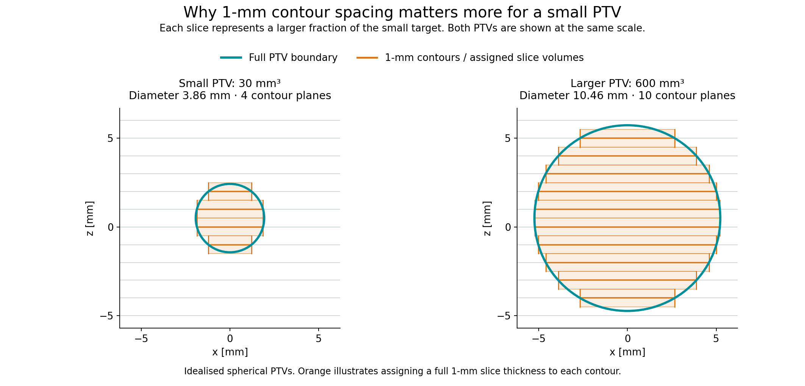
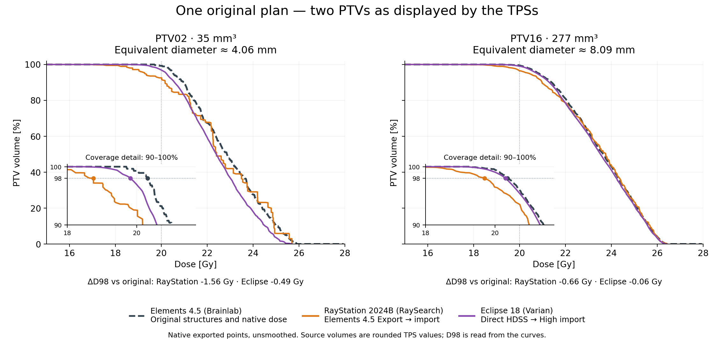

# srs-dvh

[](https://github.com/Kiragroh/srs-dvh/actions/workflows/tests.yml)

**A 3D DVH builder for HDSS-derived and other high-definition structures.**

## Why HDSS support matters

A tiny SRS target may span only two or three CT sections. Reducing its fine shape
to those sections can change the target even when the dose is unchanged. A
receiving system may import the contours correctly and still evaluate a different
body from the original. Replanning on that body can conceal the discrepancy.

**HDSS addresses an information-loss problem. Its benefit must survive both
structure handling and dose evaluation.** A successful import, a High import
option, or a smooth DVH does not by itself establish that preservation.

## How we use the extra information

Keep geometry and dose in physical coordinates. Reconstruct the complete 3D
boundary, divide its volume into small contributions, interpolate the available
dose at each contribution, and sum their volume weights. This includes the target
between CT planes and its boundary. Refinement checks numerical stability.


A well-reconstructed and sufficiently refined slice-based method can also be
accurate. The issue is coarse or missing geometry and boundary weighting, not
whether the software loops over slices. Interpolating ordinary contours cannot
uniquely restore a source shape that has already been discarded.

## Accuracy against a known answer



In a small PTV, each slice represents a larger fraction of the target. The figure
shows **two idealised spherical PTVs at the same physical scale**: 30 mm³
(3.86 mm diameter, four contour planes) and 600 mm³ (10.46 mm, ten planes).
Orange shows the 1-mm sections and their assigned slice volumes; teal keeps the
complete boundary. Both centres are halfway between planes.

The illustration explains the geometry. Its companion numerical check uses
**the same exact continuous dose and shape** for both sampling methods. The
largest gap from the known answer at the tested dose thresholds is **6.52 vs
0.32 percentage points** for the small PTV and **0.84 vs 0.06 points** for the
larger PTV (plane-only vs complete 3D integration at 0.05 mm).

This demonstrates volume-integration accuracy under controlled inputs, not a
ranking of TPS vendors. Finer integration cannot recover missing dose detail.
Reproduce the data and figure with
[plot_ptv_sampling.py --recalculate](examples/plot_ptv_sampling.py).
The [additional analytical tests](docs/validation.md) retain the four original
shape/position cases and separate dose-grid sensitivity checks.

## Preserve the target through the complete route

Use **unchanged dose and the same evaluator** for original and transferred
geometry. Across 120 source-to-HDSS checks, decoding the source grid recovered
the original binary structures. D98 and integrated volume were identical; the
largest plotted curve difference was 0.00011 percentage points. Both inputs used
the same unsmoothed level-0.5 boundary. This is source preservation, not a promise
of identical native TPS DVHs or zero error in every importer.

[Paired preservation example](docs/complete_3d_comparison.png) ·
[Measured results and limits](docs/forward_validation.md)

For replanning, evaluate the **same new dose on both the planning target and the
original target**. That exposes changes hidden by evaluating only the imported
structure. New-versus-old optimisation is a separate comparison.

## An additional option for approaching native DVH readouts

Use the fine 3D boundary to select dose-grid centres, then count each selected
point with one dose-cell volume. In a fixed comparison of all 24 GTV-only targets,
the mean absolute D98 gap from the native TPS was **0.234 ± 0.254 Gy**, compared
with **0.601 ± 0.511 Gy** using CT planes (mean ± sample SD). The largest residual
was **0.958 Gy**. Both methods used the same recovered HDSS surface and fine dose.

This is an alternative algorithm, not a software-product label or a complete
TPS emulation. It counts boundary cells differently from full-volume integration.
[How it works, the comparison figure and executable example](docs/surface_grid.md).

## Understand the TPS observations

Native DVH exports and screenshots establish what a TPS actually displays.
These two matched PTVs come from the same public synthetic 1-mm-margin plan:



The small PTV02 illustrates the largest negative RayStation D98 gap in the set;
PTV16 is the larger example already used in the matched-target comparison.
All original points and repeated dose coordinates are retained. The insets
enlarge the 90–100% coverage region. These observations combine the transfer
route, available dose and native evaluator; they do not isolate a single cause.
[Exact input curves and all 24 PTV metrics](examples/data/native_ptv_examples.json) ·
[Reproduce the figure](examples/plot_native_ptv_examples.py).

DICOM-based models then investigate why: dose-voxel values with fractional
volume weights explain one stepped readout; shape reconstruction and interpolated
dose better explain another smooth readout. These are tested hypotheses, not
identified proprietary algorithms or production TPS-emulation modes.

Matching a native curve and accurately evaluating a known 3D body are different
tests. Our full-volume calculation does not always lie closest to a native TPS
curve. Boundary conventions and the available dose field still matter.
[Native evidence, models and residuals](docs/tps_method_hypotheses.md).

[Calculation explained](docs/dvh_explained.md) · [Methods](docs/methods.md) ·
[Validation](docs/validation.md) · [Fair dicompyler-core checks](docs/dicompyler_fairness.md)

## Install and run

Python 3.10 or newer. Clone the repository and install locally:

```sh
git clone https://github.com/Kiragroh/srs-dvh.git
cd srs-dvh
python -m pip install -e ".[contours,surfaces,dev,examples]"
python examples/quickstart.py
python -m pytest tests -q
```

The package is distributed through this repository; these instructions do not
assume a PyPI release. NumPy and SciPy are the core dependencies. Shapely is
needed for the polygon adapter; scikit-image and VTK for the optional surface
adapter; Matplotlib for example figures.

## Use with your own arrays

```python
from srs_dvh import DoseGrid, VoxelROI, converge

# Arrays and affines must already describe the same physical coordinate frame.
dose = DoseGrid(dose_array_Gy, dose_index_to_world_affine)
roi = VoxelROI(binary_mask, roi_index_to_world_affine)
dvh, evidence = converge(roi, dose)

if not evidence["converged"]:
    raise RuntimeError("Integration has not met the refinement criteria")

print(dvh.metrics())
volume_percent = dvh.volume_at_dose([15, 18, 20, 22, 25, 28])
```

Coordinates are in **mm**, dose in **Gy**, volume weights in **mm³**. Each affine
maps array-index **voxel centres** to physical coordinates. There is no assumed
array-axis order: the affine columns define it. Verify registration first. No
shift, dose scaling or threshold is fitted to a reference TPS curve.

## Supported geometry

| Input | Evaluated volume |
|---|---|
| `VoxelROI` | Complete occupied binary voxels, including the outer half-voxel extent |
| `ImplicitROI` | A mathematical body specified by a physical-space predicate and bounding box |
| `PolygonSlabROI` | Polygons with holes and explicit slab intervals on parallel, possibly oblique planes |
| `SurfaceROI` with `calculate` | Interior of a supplied closed surface, using refined midpoint volume integration |
| Custom adapter | `quadrature(step_mm)` yielding physical points and positive volume weights |

High-definition source planes can be evaluated in their own basis without first
sampling them onto CT slices. The [oblique-contour example](examples/oblique_contours.py)
shows this interface. For DICOM RTSTRUCT or HDSS files, a separate reader must
supply the correct source planes, physical frame and geometric reconstruction.
This release is a numerical DVH builder, not a DICOM importer or HDSS file writer.

`PolygonSlabROI` integrates an **explicit polygon-prism model** using exact clipped
areas. It does not guess missing contours or a TPS-specific interpolation between
planes. See the [methods and input contract](docs/methods.md).

## Accuracy and examples

The repository contains **26 tests** covering known spherical DVHs, oblique and
anisotropic coordinates, unequal volume weights, holes, tiny contour caps,
out-of-grid rejection and refinement checks, plus surface reconstruction,
discrete grid sampling, nested cavities and explicit partial coverage.

The [analytical benchmark](examples/analytical_benchmark.py) uses four
sphere/ellipsoid configurations. At 0.025-mm integration spacing, its largest
absolute D98 error against the exact continuous-dose result is **0.0012 Gy**.
The largest curve error on the benchmark's stated plotting thresholds is
**0.157 percentage points**. These are results for those test fields, not a
universal accuracy guarantee. [Results and scope](docs/validation.md).

The same script also tests input dose-grid spacing separately. That is a different
source of error from volume integration. [Dose-grid sensitivity](docs/analytical_srs_dvh.png).


`converge` requires **two consecutive refinements** to satisfy dose-metric,
volume and curve tolerances. The curve comparison uses the exact maximum
difference between the two empirical DVHs over **all observed dose thresholds**,
independent of plotting bins. Always inspect the returned evidence.

Numerical convergence applies to the supplied dose and geometry. It does not
prove that those inputs reproduce a TPS's internal surface or DVH volume.
No TPS is launched and no input DICOM is changed.

## For vendors and researchers

High-definition geometry support and adequate DVH evaluation belong together:
discarding the additional geometry during evaluation can remove its benefit.
Input dose resolution also matters. The [comparison protocol](docs/vendor_comparison.md)
separates geometry transfer, dose representation, numerical integration and
replanning. Use analytical tests before comparing real plan data.

Research software; clinical use requires separate commissioning and validation.

## Cite and contribute

Use [CITATION.cff](CITATION.cff) and the specific release or commit for reproducible
references. No DOI or peer-reviewed validation paper is claimed by this release.
Reproducible issues and pull requests are welcome; use synthetic examples rather
than patient information. Licensed under [MIT](LICENSE).
