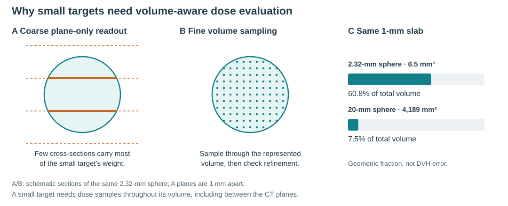

# Small targets need volume-aware DVHs

A DVH asks what fraction of a structure receives at least a given dose. Both
the represented boundary and the volume assigned to each dose sample matter.
HDSS preserves extra geometry only if the receiving workflow also uses it.



## The problem

A target only two or three millimetres across may occupy just a few CT planes.
Counting those sections with a full slice-thickness weight can overrepresent or
miss boundary regions. Finer in-plane pixels alone do not fix missing depth
information. Oblique or thin structures and steep dose gradients amplify this
effect. For large, compact structures the relative influence is usually smaller.

## The calculation

1. Keep geometry and dose in the same physical frame, including registration.
2. State the body being evaluated: full source voxels, an explicit closed
   surface, an analytical shape, or contours with declared slab intervals.
3. Sample small volume contributions throughout that body, including between
   image planes. For contour slabs, clipped boundary areas supply volume weights.
4. Interpolate the available dose at those physical points. Add the weights
   receiving at least the requested dose and divide by total represented volume.
5. Refine the sampling and check changes in volume, dose metrics and the full DVH.

```text
V(20 Gy) = 100 × volume receiving at least 20 Gy / represented target volume
Dmean   = sum(dose × volume weight) / sum(volume weights)
```

D98 comes from the weighted dose distribution; plotting bins do not determine
the scalar. No spline, dose scale or spatial shift is fitted to a TPS curve.
A 0.05-mm integration step does not turn a 1-mm dose field into a newly
calculated 0.05-mm field: interpolation retains the limits of the supplied dose.

## One method for a fair comparison

Use unchanged dose and the same integration rule for the original and transferred
geometries. The current benchmark uses an unsmoothed level-0.5 surface for original
and recovered HDSS masks, and explicit polygon slabs for ordinary contours.
The [paired example](complete_3d_comparison.png) shows source preservation under
that stated model. Replanning is a separate experiment: evaluate the new dose
on both the original and returned geometries.

The [native-TPS comparison](native_workflow_comparison.png) uses solid native
curves before export and dashed independent readouts. The full 3D workflow keeps
fine source information, but does not exactly reproduce the TPS or improve every
scalar. It can count boundary volume differently. Use the native curve as a
comparison, and unchanged dose plus one method to isolate the transfer effect.

## Native TPS evidence and model checks are different

An actual TPS comparison starts with native exported DVH points, matched ROI
names and a check that the complete replot reproduces the TPS view. Preserve
vertical jumps and do not smooth, shift or scale curves to make them agree.
A whole import route includes several effects; common-dose/common-evaluator
pairs isolate the changed represented geometry.

In the present independent-method check, the plane-based readout is closer to
the native D98 on average in every target group. This does not demonstrate that
less geometry information is better, or that full-volume integration is a TPS
emulator. The stated boundary model and available dose still matter.

## Use the native curves to test an explanation

Do not stop at replotting the exports. Hold DICOM dose and coordinates fixed,
then test explicit choices for boundary reconstruction, partial-volume weights
and dose interpolation. Native curves and screenshots tell us whether those
choices reproduce the observed behaviour. For tiny targets, a few differently
weighted boundary contributions can move an entire curve.

[The TPS-method check](tps_method_hypotheses.md) illustrates this distinction:
one native view is explained by discrete dose values and fractional weights,
another by reconstructed shape and interpolated dose. Matching these views is a
separate task from preserving HDSS geometry under one common evaluator.

## What is meant by “slice by slice”

Coarse plane-only evaluation is limited by its spacing in depth. A method which
reconstructs the body, integrates between planes and handles boundaries can be
accurate even if its code processes one slice at a time. The main comparison holds fine dose fixed and changes the represented geometry
and how its volume is sampled. Ordinary contours can also be interpolated
between planes, but missing original geometry cannot be recovered uniquely.
Separate dicompyler checks use regular exported dose; they are diagnostics, not
proof that every TPS uses those algorithms. [dicompyler API](https://dicompyler-core.readthedocs.io/en/latest/_modules/dicompylercore/dvhcalc.html).

[Input contract and tolerances](methods.md) · [Numerical evidence](validation.md)
