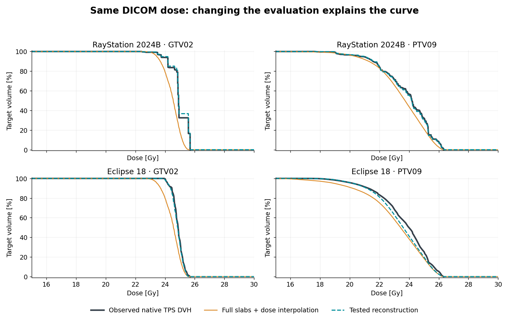

# What makes the native TPS curves look different?

**The DVH export shows the result. DICOM dose and geometry let us test why it
looks that way.** The screenshots check the drawing; they are not used to fit
the computation.

The following check uses one public-anatomy, synthetic SRS benchmark: 24 GTVs
and 24 PTVs in its 1-mm-margin plan. RayStation 2024B receives ordinary
CT-plane contours; Eclipse 18 receives HDSS with High import. The RayStation
model uses the supplied ordinary RTSTRUCT; the Eclipse model uses its ordinary
contour reexport. In each model test,
dose values and physical coordinates are fixed. No shifts, dose scales or
target-specific parameters are fitted.

Grey is the native export. Teal is a computed hypothesis. Orange treats the
contours as complete slabs and interpolates dose throughout them. The rows
have different imported geometries, so this is not an isolated contest between
two DVH engines. GTV02 and PTV09 are examples; the summary uses all 48 targets.

## RayStation: a few dose values can make visible steps

Assign each dose voxel the volume of its intersection with the represented ROI.
Count that weight at the voxel's stored dose, without introducing intermediate
dose values. A small structure can then have large visible steps. The tested
model computes exact polygon/dose-cell overlaps for axial 1-mm contour slabs.

All 4,541 selected native jump samples coincide with nearby stored DICOM dose
values within the text export's 0.0005-Gy rounding. A fixed +0.013-Gy negative
control matches only 86. Fractional-volume weighting reproduces most of the
native curve. This supports the mechanism; it does not identify every internal
boundary or histogram rule.

## Eclipse: reconstruct the body, then interpolate dose

The tested model interpolates signed distances between contour planes,
closes the body at the outermost planes, and samples trilinear dose at
8×8×8 subpoints per dose cell. It is much closer to the native curves than
complete extruded slabs. Native structure volumes provide an additional check:
mean absolute volume differences are 2.85% for GTVs and 1.30% for PTVs,
without rescaling the model to those volumes.

Varian describes shape-based distance interpolation and interpolated DVH dose
in its [Eclipse Algorithms Reference Guide 13.6, chapter 13, pp.289–291](https://jpneylon.github.io/ABR/PDFs/Add_052418/EclipseAlgorithms13.6_RefGuide.pdf#page=289).
This older description supports the proposed mechanism, not all details of
version 18. Six fixed shape/endpoint alternatives were compared. The displayed
configuration was selected on this benchmark; its exact end rule is not a
confirmed vendor implementation.

## How close are the tested models?

For each target, average the absolute model/native dose separation over D1–D99.
Then report mean ± sample SD over 24 targets. The last column retains D98 tail
differences, which can be larger than the average curve gap.

| Native reference / ROI | Full slabs + interpolated dose: mean gap | Tested model: mean ± SD | Residual ΔD98 range |
|---|---:|---:|---:|
| RayStation / GTV | 0.272 Gy | 0.027 ± 0.024 Gy | −0.40 to +0.94 Gy |
| RayStation / PTV | 0.347 Gy | 0.041 ± 0.015 Gy | −0.01 to +0.32 Gy |
| Eclipse / GTV | 0.231 Gy | 0.059 ± 0.052 Gy | −0.39 to +0.10 Gy |
| Eclipse / PTV | 0.307 Gy | 0.086 ± 0.064 Gy | −0.38 to +0.14 Gy |

Refining six numbered examples to 16×16×16 changed volume by less than 0.90%
and D98 by at most 0.032 Gy. These are dataset-specific reconstruction checks,
not clinical tolerances or independent validation on another cohort.

## What this means for HDSS

**Geometry preservation and DVH evaluation are separate requirements.** An
interpolated, smooth curve can still describe a changed target. Conversely, a
stepwise DVH can follow consistently from counting discrete dose values.

The common `srs-dvh` integrator evaluates a declared 3D body with explicit volume
weights and a stated dose field. Use it unchanged on original and transferred
geometry to isolate the transfer effect. The TPS-specific probes above are
research hypotheses, not production TPS emulation modes supplied by the package.

Fine integration cannot restore dose information lost in export. Agreement with
a native TPS using finer local dose fields is therefore a further input-and-method
comparison, not simply a test of HDSS.

[Calculation contract](methods.md) · [Source-preservation check](forward_validation.md)
